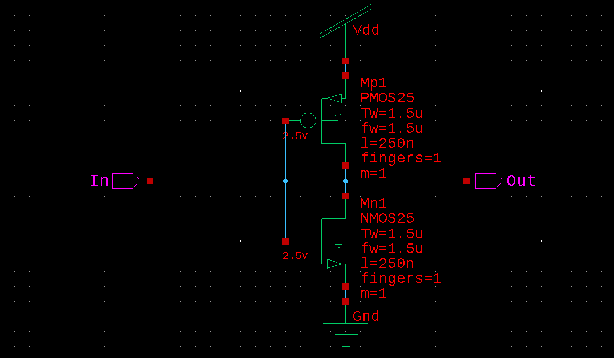

# Simple Inverter in S-Edit and L-Edit

This is my first project where I make a simple inverter in S-Edit, and then create the corresponding layout in L-Edit

## Inverter S-Edit Schematic
In this schematic, I do not use Vdc to set a Vdd to 5V, because L-Edit LVS will fail if I do so. Instead, I will create a symbol and simulate that instead to verify the correctness of the circuit.

    

## Inverter Waveform
Below are two simulation waveforms that verify the correctness of the circuit.

    

    

