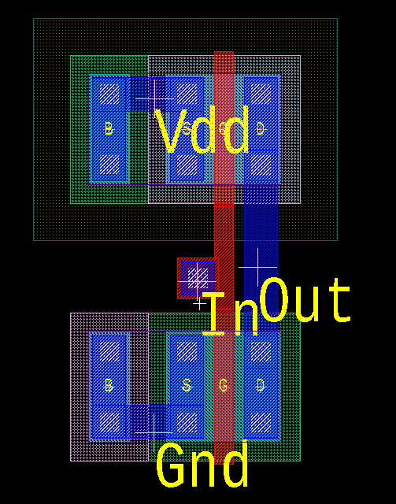

# Simple Inverter in S-Edit and L-Edit

This is my first project where I make a simple inverter in S-Edit, and then create the corresponding layout in L-Edit

## Inverter S-Edit Schematic
In this schematic, I do not use Vdc to set a Vdd to 5V, because L-Edit LVS will fail if I do so. Instead, I will create a symbol and simulate that instead to verify the correctness of the circuit.

    

## Inverter Waveform
Below are two simulation waveforms that verify the correctness of the circuit.

    

    

These waveforms show that the inverter is working as intended, since the output is always opposite of the input 

## T-Spice File
This is the .sp file for my schematic
* [T-Spice file](lab1_redo_sym.sp)

## Inverter L-Edit Layout

Here is the layout of the inverter. Since I am only making a single inverter, I placed the Vdd and Gnd ports directly on the bulk and source, instead of making rails that run along the top and bottom of the design.

    

## Calibre DRC, LVS, and PEX

After completing the layout, I ran Calibre DRC, LVS, and PEX to verify the physical design. DRC is used to ensure the design follows manufacturing process rules, LVS is used to ensure that the layout matches the schematic, and PEX is used to extract parasitic capacitances, which I will use later on.

* [DRC Summary](lab1_redo.drc.summary)
* [LVS Report](lab1_redo.lvs.report)
* [PEX netlist](lab1_redo.pex.netlist.lab1_redo.pxi)

## Re-simulate waveforms with PEX

With the new PEX information, I can take the .pex.netlist file and add the .sp file into it to simulate the same waveforms above, but with the effects of the parasitic capacitances.

    

    

