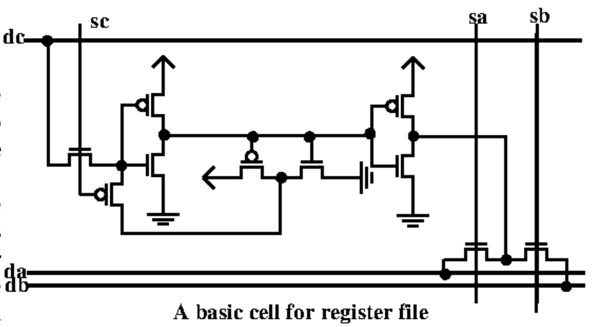
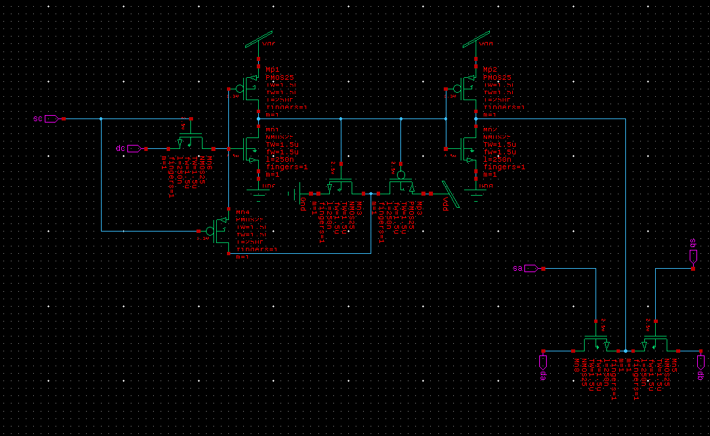

# Register Cell Project

This is my second project, where I made the schematic and layout for a register cell in S-Edit and L-Edit. 

    

## Schematic of the Register Cell

    

This is the S-Edit schematic of the register cell. I did not include any voltage sources here until later because they would affect LVS and PEX. For the later simulations, I created a symbol of this schematic and used vbit to set specific patterns for the inputs sc, dc, sa, and sb, and V_VoltagePrint to see the waveforms in the waveform viewer.

## Spice Netlist

* [Register Cell T-Spice File](lab2_redo.sp)

