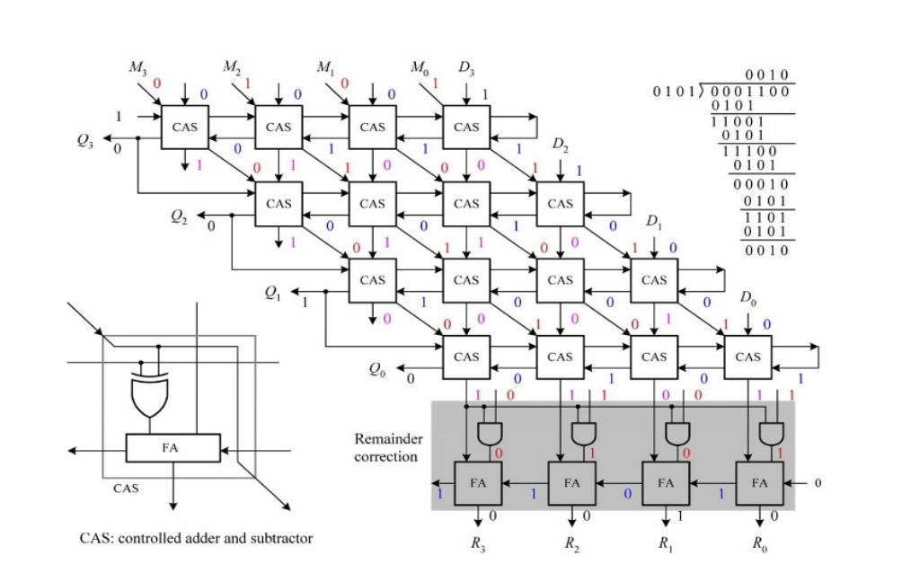

# Four Bit Divider Project

This is my third project, where I create the schematic and layout for both a CAS cell and FA+AND cell, and then create the schematic for the four bit divider by combining the cells together which you can see in the figure below.

    

## CAS and FA+AND Schematics, Spice Netlists, and Waveforms
### CAS Cell
#### CAS Schematic

Here, I design the CAS cell at the transistor level

    

#### Spice Netlist
* [CAS T-Spice File](Lab3_CAS.sp)

### Simulation Waveform

The following waveform is just to show that the CAS cell works as intended. One of the later images will show the simulation with PEX.

    

### FA+AND Cell

Here, I design the FA+AND cell at the transistor level

    

#### Spice Netlist
* [FA+AND T-Spice File](Lab3_AND_FA.sp)

#### Simulation Waveform
The following waveform is just to show that the FA+AND cell works as intended. One of the later images will show the simulation with PEX.

    

## CAS and FA+AND Layout
### CAS Cell

Here, I perform layout for the CAS transistor schematic

    

### FA+AND Cell

Here, I perform layout for the FA+AND transistor schematic

    

## Best and Worst Rise and Fall Times from Inputs to Outputs
### CAS Cell Timing Analysis

